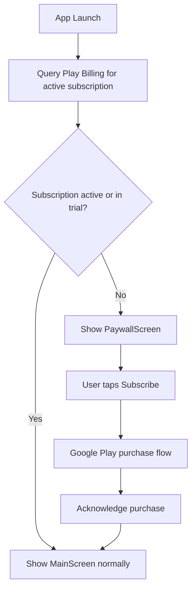

# Play Store Launch Plan

## Critical Warning: Google Play SMS Policy

Google Play **heavily restricts** apps that use SMS permissions (`RECEIVE_SMS`, `READ_SMS`, `SEND_SMS`). Only apps declared as the **default SMS handler** or those with an approved exception can use these permissions. PTK declares full default-SMS-app components, so it qualifies under that category, but you will need to:

- Fill out Google's **SMS/Call Log Declaration Form** during Play Console setup
- Explain why the app needs default SMS handler status
- Expect a **manual review** that can take days/weeks
- Shizuku/Power Mode (which uses privileged shell access) may raise additional review flags -- consider documenting it clearly or making it a sideload-only feature

## Phase 1: Google Play Developer Account

- Register at [play.google.com/console/signup](https://play.google.com/console/signup) ($25 one-time fee)
- Requires: Google account with 2-step verification enabled, valid government ID, credit card under your legal name
- Choose "Personal" account type
- Complete identity verification (can take 48 hours)
- Set up a Merchant account (required for paid apps/subscriptions) via Google Payments
- **Important (2024+ rule):** New personal accounts must run a **closed test with at least 12 opted-in testers for 14 consecutive days** before Google grants production access

## Phase 2: Release Signing

- Generate an upload keystore (`.jks` file) using `keytool`
- Store it securely outside the repo (e.g., Doppler or a local-only path)
- Add `signingConfigs` block to [`app/build.gradle.kts`](app/build.gradle.kts) for the `release` build type
- Reference keystore credentials from `local.properties` or environment variables (never committed)
- Enable R8 minification (`isMinifyEnabled = true`) and add Play Billing ProGuard rules to [`app/proguard-rules.pro`](app/proguard-rules.pro)

## Phase 3: Google Play Billing Integration

This is the largest code change. Add the Play Billing Library to manage the $1/month subscription with a 30-day free trial.

### Dependencies

Add to [`gradle/libs.versions.toml`](gradle/libs.versions.toml):

```toml
billing = "7.1.1"
```

```toml
billing = { group = "com.android.billingclient", name = "billing-ktx", version.ref = "billing" }
```

Add to [`app/build.gradle.kts`](app/build.gradle.kts):

```kotlin
implementation(libs.billing)
```

### New Files

- `app/src/main/kotlin/com/personal/ptk/billing/BillingManager.kt` -- wraps `BillingClient`, handles connection, purchase flow, subscription status queries, and acknowledgement
- `app/src/main/kotlin/com/personal/ptk/billing/SubscriptionState.kt` -- sealed class: `Active`, `Trial`, `Expired`, `Unknown`
- `app/src/main/kotlin/com/personal/ptk/ui/PaywallScreen.kt` -- shown when subscription is expired; displays trial/subscribe CTA

### Subscription Flow



### Key Implementation Points

- `BillingManager` connects in [`App.kt`](app/src/main/kotlin/com/personal/ptk/App.kt) `onCreate()` and exposes a `StateFlow<SubscriptionState>`
- [`Navigation.kt`](app/src/main/kotlin/com/personal/ptk/ui/Navigation.kt) checks subscription state at the top level -- if expired, route to `PaywallScreen` instead of `MainScreen`
- The SMS receiver ([`SmsReceiver.kt`](app/src/main/kotlin/com/personal/ptk/sms/SmsReceiver.kt)) should still function even if subscription lapses (grace period / keep protecting the user) -- but the UI gates access
- Trial and subscription are configured server-side in Google Play Console, not in app code -- the app just reads the subscription status
- Product ID: `ptk_monthly` (configured in Play Console under Monetization > Subscriptions)

### Play Console Subscription Setup

- Create subscription product `ptk_monthly` at $0.99/month
- Add a base plan with a 30-day free trial offer
- Google handles trial tracking, billing, cancellation, and renewal

## Phase 4: Privacy Policy

Google Play requires a privacy policy URL for apps using SMS, contacts, and notification access permissions.

- Create a privacy policy covering: SMS data access (read/delete), contact data (allowlist check only, not stored), on-device ML processing (no cloud transmission), notification access, and data retention (Vault entries)
- Host it at a public URL (GitHub Pages, a simple static site, or a Google Doc with public link)
- Add the URL to both the Play Store listing and in-app Settings screen

## Phase 5: Store Listing Assets

Required for Play Console submission:

- **App title**: "PoliticalTextKiller - SMS Spam Filter" (max 30 chars for short title)
- **Short description**: 80-char pitch
- **Full description**: Feature list, how it works, privacy emphasis
- **Screenshots**: At least 2 phone screenshots (can use Android emulator or phone screen captures)
- **Feature graphic**: 1024x500 PNG (Play Store banner)
- **App icon**: Already exists (512x512 adaptive icon) -- verify it exports cleanly at 512x512
- **Content rating**: Complete the IARC questionnaire in Play Console
- **App category**: Communication or Tools

## Phase 6: Build and Submit

- Run `gradlew assembleRelease` or `gradlew bundleRelease` (AAB preferred for Play Store)
- Test the signed release build on device
- Upload AAB to Play Console
- Complete the SMS/Call Log declaration form
- Set pricing: Free with in-app subscription
- Submit for review

## Files That Will Be Modified

- [`app/build.gradle.kts`](app/build.gradle.kts) -- signing config, billing dependency, R8 enabled
- [`gradle/libs.versions.toml`](gradle/libs.versions.toml) -- billing version
- [`app/proguard-rules.pro`](app/proguard-rules.pro) -- billing keep rules
- [`app/src/main/kotlin/com/personal/ptk/App.kt`](app/src/main/kotlin/com/personal/ptk/App.kt) -- init BillingManager
- [`app/src/main/kotlin/com/personal/ptk/ui/Navigation.kt`](app/src/main/kotlin/com/personal/ptk/ui/Navigation.kt) -- subscription gate
- [`app/src/main/kotlin/com/personal/ptk/ui/SettingsScreen.kt`](app/src/main/kotlin/com/personal/ptk/ui/SettingsScreen.kt) -- subscription status display, manage subscription link, privacy policy link

## New Files

- `app/src/main/kotlin/com/personal/ptk/billing/BillingManager.kt`
- `app/src/main/kotlin/com/personal/ptk/billing/SubscriptionState.kt`
- `app/src/main/kotlin/com/personal/ptk/ui/PaywallScreen.kt`
