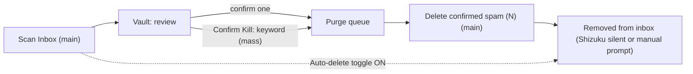
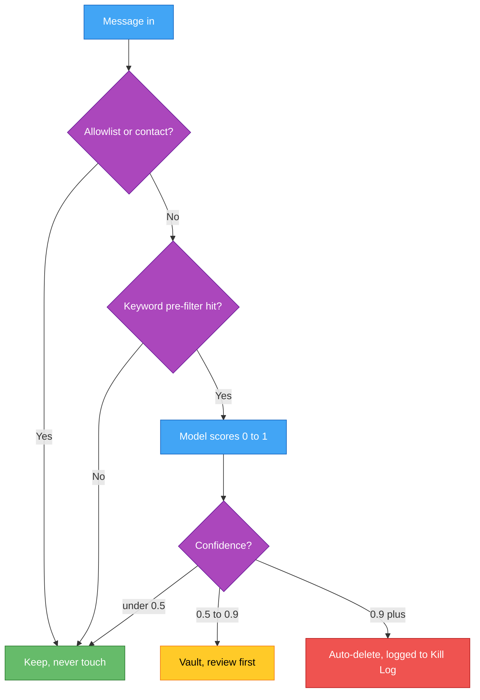

## PoliticalTextKiller UI/UX Refactor

### Design principles
- Main screen holds primary actions; Settings holds only true settings.
- One coherent inbox-cleaning model: scan -> review -> delete (with an opt-in skip-review toggle).
- Power Mode stays as the aspirational Shizuku-gated real-time switch.
- Shizuku availability is the capability; Power Mode is an intentional user choice (unchanged).

### The consolidated inbox-cleaning model

This reuses existing DAO methods (`confirmByReasonAndRule`, `confirmBySender`, `getPendingReviewFlow`, `countPendingPurgeFlow`) and `InboxScanner`/`InboxPurger`.

### 1. Remove Suggested Keywords (dangerous generic words)
In [app/src/main/kotlin/com/personal/ptk/ui/MainScreen.kt](app/src/main/kotlin/com/personal/ptk/ui/MainScreen.kt):
- Delete the entire "Suggested Keywords" `Card` (the `if (suggestions.isNotEmpty())` block).
- Remove `suggestions` state and the `KeywordSuggester.suggest(...)` / `getBodiesSince(...)` lines in `refreshStats()`.
- Remove the `KeywordSuggester` import.
- After confirming no other references, delete `app/src/main/kotlin/com/personal/ptk/util/KeywordSuggester.kt`.

### 2. Surface inbox actions on the main screen
In `MainScreen.kt`, in the space freed by Suggested Keywords, add an "Inbox Cleanup" card:
- "Scan Inbox" button -> `InboxScanner.scan(deleteFromInbox = autoDelete)`; when not auto-deleting, vault for review and offer to open the Vault.
- "Delete confirmed spam (N)" button (N = `countPendingPurgeFlow`) -> the purge path.
- Port `runScan`/`runPurge` logic and the `smsRoleLauncher` (manual `RoleManager` fallback) from `SettingsScreen` into `MainScreen` (or a shared helper). Silent path when `ShizukuHelper.isActive`, manual default-app prompt otherwise.

### 3. Add the opt-in auto-delete toggle
- New pref `PREF_AUTO_DELETE` in [app/src/main/kotlin/com/personal/ptk/App.kt](app/src/main/kotlin/com/personal/ptk/App.kt) (default false).
- Toggle in Settings: "Auto-delete detected spam (skip review)". When on, "Scan Inbox" deletes immediately instead of vaulting; main card copy adapts.
- Note: this governs the inbox-scan path; real-time incoming deletion remains governed by Power Mode.

### 4. Strip operational actions from Settings
In [app/src/main/kotlin/com/personal/ptk/ui/SettingsScreen.kt](app/src/main/kotlin/com/personal/ptk/ui/SettingsScreen.kt):
- Remove the "Scan Inbox" card (incl. "Diagnose Rules" debug block) and the "Purge Spam from Inbox" card.
- Keep: Nuclear Shortcode Mode, Vault Retention, Default SMS App status/switch-back, Shizuku Power Mode (status + Enable Power Mode + Auto-Start guide).
- Add the new Auto-delete toggle.
- ML toggle: keep but relabel/disable with "model not installed yet" until the ML phase (see Phase 6).

### 5. Tiered, re-openable Setup & Help
Refactor [app/src/main/kotlin/com/personal/ptk/ui/SetupScreen.kt](app/src/main/kotlin/com/personal/ptk/ui/SetupScreen.kt) to support two modes: first-run wizard (gated, as today) and a browsable Help mode (Back button, all tiers visible):
- Level 1 - Basic protection: the existing 4 permission steps + explanation of the manual delete path (no Shizuku required).
- Level 2 - Silent deletion (Shizuku): what it is, install, pair via wireless debugging + code, grant PTK permission, enable Power Mode. (Consolidate the guidance currently in Settings.)
- Level 3 - Hands-off (Automate keeper): why Shizuku dies on reboot, install Automate + the Shizuku Keeper flow, battery-optimization exemptions.
- Add a route in [app/src/main/kotlin/com/personal/ptk/ui/Navigation.kt](app/src/main/kotlin/com/personal/ptk/ui/Navigation.kt) (e.g. `Screen.Help`) and a "Setup & Help" entry from `MainScreen` (top-bar icon or nav card).

### 6. One-time cleanup of the stale "Purge = 1" artifact
After rebuild/install, clear the lingering confirmed-but-unscrubbed test entry via the Vault's existing Clear/Restore-All (or a one-shot ADB delete). No code change; just a clean-slate step.

## Phase 2: On-device ML classifier (TFLite via LLM distillation)

Decoupled from the app: a standalone offline dev tool. The first deliverable (extract + label + analyze) runs before any training so the user can judge data quality on real numbers.

### Decisions (locked)
- Engine: on-device TFLite (runs on the S25+ and every Android). Gemini Nano deferred - not supported on the S25+ (Google's list covers only Samsung Z Fold7 / Z TriFold and S26 series); revisit as auto-detected enhancement for a Play Store build.
- Labeling: OpenAI gpt-4o-mini via Doppler secret LLM_OPENAI_4O_MINI (project mycredentials, config prd_personal). DeepSeek (LLM_DEEPSEEK) as cheaper fallback.
- Dataset: device path /storage/emulated/0/BakupSMSCallLog/sms-20260201004700.xml (header count=80607, 4.78GB - inflated by base64 MMS media which we discard). adb at D:\adb\adb.exe; device R5CY33193CF.
- Scope: binary only (political spam vs not). General/merchant spam is explicitly out of scope.

### New folder: ml-spam-training/ (project root, sibling of app/)
- README.md - usage, including running via doppler to inject the key.
- requirements.txt - openai, pandas (stdlib xml.etree.iterparse for streaming).
- config.py - paths, model name (gpt-4o-mini), batch size, label schema.
- step1_extract.py - adb pull (or read pulled copy); stream-parse with iterparse; emit data/messages.csv (id, address, date, type, body); skip MMS media/base64.
- step2_label.py - read messages.csv; batch ~30/call to gpt-4o-mini; strict JSON out {id, label: POLITICAL_SPAM|NOT, confidence, reason}; checkpoint to data/labeled.csv so it is resumable; rate-limit + retry.
- step3_analyze.py - data/report: spam vs ham counts, confidence histogram, dedupe stats, and samples of low-confidence + spam rows for manual spot-check.
- data/ - gitignored outputs.

Run pattern: `doppler run --project mycredentials --config prd_personal -- python ml-spam-training/step2_label.py`

### Safety model (precision-first; "never kill a legit text")

- Optimize precision (avoid false positives), accept lower recall. Judge by precision/recall on a 20% held-out test set, not accuracy.
- Allowlist/contacts always bypass the model. Auto-delete only at score >= 0.9; 0.5-0.9 -> Vault; < 0.5 -> ignore.
- Everything auto-deleted stays restorable from the Kill Log.
- Shadow mode: ship log-only first; user watches Kill Log verdicts vs reality, then opts into auto-delete.

### Train + ship (after data validated)
- Tokenize to match `MlClassifier` (word-index, maxLen 128); build vocab.json.
- Small Keras classifier; tune threshold for ~99%+ precision.
- Convert to political_spam_model.tflite; drop it + vocab.json into app/src/main/assets/ (exactly what MlClassifier.kt already expects).
- Self-improvement: periodically re-label/retrain from accumulated Vault/Kill Log verdicts and ship an updated .tflite.

### Out of scope / unchanged
- The Shizuku real-time deletion orchestration (`ShizukuHelper.fireAndForgetDelete`) - already working; not touched.
- No hamburger menu (per your preference).