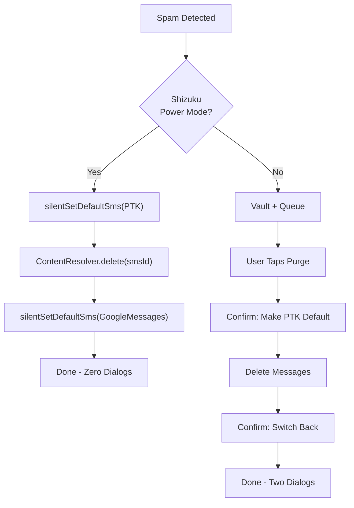

# Shizuku Power Mode Integration

## Problem

Android requires user confirmation dialogs to switch the default SMS app, making PTK's switch-and-scrub workflow clunky (two confirmation screens per operation). With Shizuku (ADB-level privileges), PTK can silently toggle the SMS role and delete messages with zero user interaction.

## Architecture: Dual-Mode Operation



## Key Technical Approach

Shizuku runs shell commands as UID 2000. The critical command:

```bash
cmd role add-role-holder android.app.role.SMS com.personal.ptk
```

This silently assigns the SMS role -- no confirmation dialog. PTK then deletes normally using its existing `ContentResolver.delete()` code, then switches back:

```bash
cmd role add-role-holder android.app.role.SMS com.google.android.apps.messaging
```

A fast-path will also be tested: `content delete --uri content://sms/{id}` directly from shell, which would skip the role switching entirely for single-message deletes.

## Files to Create

- [app/src/main/kotlin/com/personal/ptk/util/ShizukuHelper.kt](app/src/main/kotlin/com/personal/ptk/util/ShizukuHelper.kt) -- All Shizuku interaction logic:
  - `isInstalled()`, `isRunning()`, `isPermissionGranted()`, `requestPermission()`
  - `silentSetDefaultSms(pkg)` via `Shizuku.newProcess()`
  - `silentDeleteSms(smsId)` via `content delete` (fast path)
  - `withPtkAsDefault(block)` -- switches role, executes block, switches back
  - Binder lifecycle listeners

## Files to Modify

- [app/build.gradle.kts](app/build.gradle.kts) -- Add Shizuku dependencies:
  - `dev.rikka.shizuku:api:13.1.5`
  - `dev.rikka.shizuku:provider:13.1.5`

- [app/src/main/AndroidManifest.xml](app/src/main/AndroidManifest.xml) -- Add:
  - `ShizukuProvider` component
  - Shizuku permission declaration

- [app/src/main/kotlin/com/personal/ptk/App.kt](app/src/main/kotlin/com/personal/ptk/App.kt) -- Add `PREF_SHIZUKU_ENABLED` constant

- [app/src/main/kotlin/com/personal/ptk/sms/SmsReceiver.kt](app/src/main/kotlin/com/personal/ptk/sms/SmsReceiver.kt) -- After vaulting spam: if Shizuku active, silently delete the message immediately and mark scrubbed. Otherwise current behavior (queue for purge).

- [app/src/main/kotlin/com/personal/ptk/util/InboxScanner.kt](app/src/main/kotlin/com/personal/ptk/util/InboxScanner.kt) -- If Shizuku active, delete directly during scan (PTK is already silently default). Otherwise current behavior.

- [app/src/main/kotlin/com/personal/ptk/util/InboxPurger.kt](app/src/main/kotlin/com/personal/ptk/util/InboxPurger.kt) -- Same pattern: direct delete if Shizuku active.

- [app/src/main/kotlin/com/personal/ptk/ui/SettingsScreen.kt](app/src/main/kotlin/com/personal/ptk/ui/SettingsScreen.kt) -- Add "Shizuku Power Mode" section:
  - Status dashboard (installed / running / permission granted)
  - Enable toggle
  - Grant permission button
  - When enabled: Scan/Purge buttons become single-tap (no "Switch to PTK &" prefix), switch-back button disappears
  - Collapsible auto-start guidance section with instructions for the `thedjchi` Shizuku fork + one-time ADB command

## Shizuku Auto-Start Guidance (in-app)

PTK cannot programmatically start Shizuku, but the settings screen will include a collapsible "Setup Auto-Start" section explaining:

1. Install the [thedjchi Shizuku fork](https://github.com/thedjchi/Shizuku) (supports rootless boot start)
2. One-time ADB command: `adb shell pm grant moe.shizuku.privileged.api android.permission.WRITE_SECURE_SETTINGS`
3. Enable "Start on boot (wireless ADB)" in Shizuku settings
4. After reboot, Shizuku starts automatically in ~5 seconds (requires Wi-Fi)

## Safety / Graceful Degradation

- All Shizuku calls are wrapped in try-catch with fallback to standard mode
- If Shizuku dies mid-operation (PTK left as default), the existing red banner + switch-back button on VaultScreen/SettingsScreen handles it
- If Shizuku is not installed, the Power Mode section shows "Not Installed" with an install link
- No Shizuku imports crash the app if Shizuku isn't present (all access through runtime checks)
- Play Store compatible: Shizuku is used by many published apps (Tasker, Swift Backup, etc.)

## Test Plan

1. Build and install on Galaxy S25+ with Shizuku already running
2. Enable Shizuku Power Mode in settings
3. Test fast-path: does `content delete --uri content://sms/{id}` work from shell?
4. Test role-switching path: does `cmd role add-role-holder` silently switch?
5. Test real-time: send a political spam SMS, verify it gets silently deleted
6. Test Scan Inbox: verify single-tap scan with no confirmation dialogs
7. Test failover: stop Shizuku, verify app falls back to standard mode gracefully
